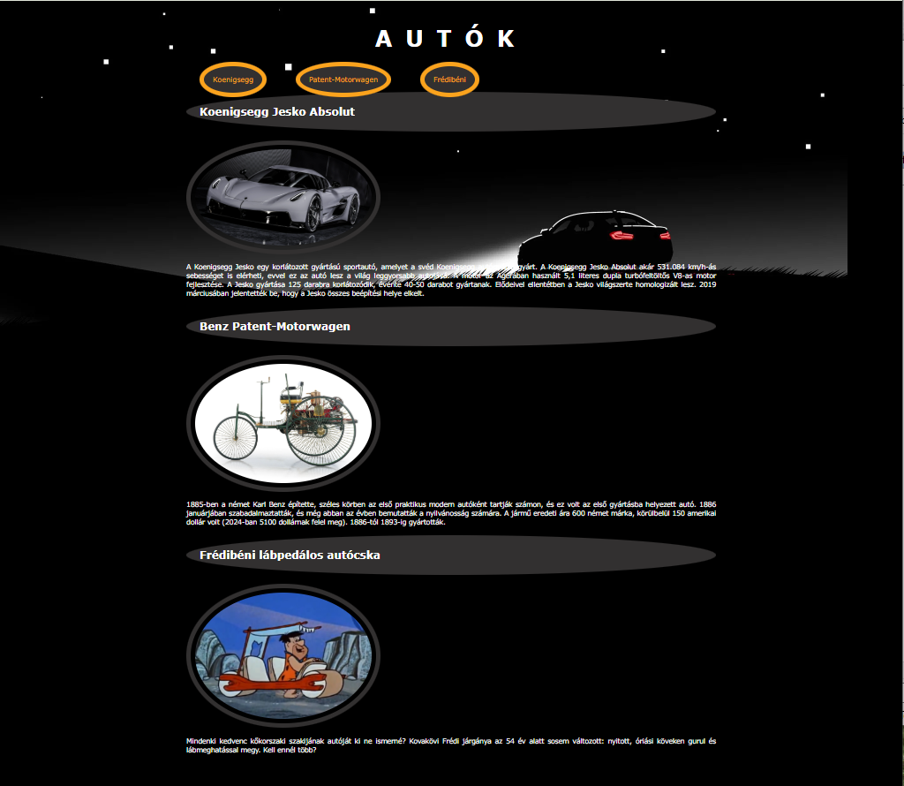

# CSS gyakorlás

## ID, class, border, width, border, padding, margin

Forkold le ezt a repositoryt és clonozd e a sajátodat a gépedre! Keresd meg a FORK ikont a github repo jobb oldalán!

``` 
git clone sajatreponeve
```

**Az alábbi feladatok elvégzése után add-olj, commit-olj és töltsd fel githubra a munkád!**
**Add le a github és a githubPages linket!**

Készítsd el a mintának megfelelő oldalt: 

<a href="https://csefikatalin.github.io/autok_matetol/">Minta</a>

### Feladatok az index.html-ben

0. A title tagbe írd be a saját nevedet!
1. A HTML oldalon készíts azonosítókat (id ) az egyes autókhoz!
2. Készíts 3 linket (<a href=""></a>) az AUTÓK felirat alá. A menüpontokra kattintva az oldal megjelölt részeihez navigálj!
3. Készíts egy új fájlt stilus.css néven!
4. Csatold a html oldalad fejlécébe!
5. Validáld az oldalad!

### Feladatok a stilus.css-ben

1. A teljes oldalra (body) állítsd be az alábbiakat: 
   - háttérszín legyen fekete
   - háttérkép ne ismétlődjön:  "kepek/auto_background_14.jpg"    
   - a betűszín legyen fehér     
   - az oldal maximális szélessége 1000px legyen.  (max-width:1000px;)
   - az oldal elgyen középre igazítva (margin:auto;)
   - állíts be Verdana, Geneva, Tahoma, sans-serif betűcsaládot!

2. A linkek: 
    - színe orange;
    - ne legyen aláhúzva
    - a belső margó legyen 20px (padding: 20px;)
    - a külső margó legyen 30px (padding: 30px;)
    - legyen szegélye! (border:10px solid orange;)
    - border-radius: 50%;
    - háttérszíne:  rgb(50, 48, 48);

3. A képekre állíts be
   - szélessége legyen 400px (width: 400px;)
   - legyen szegélye! (border:10px solid rgb(50, 48, 48);)  https://www.w3schools.com/css/css_border_shorthand.asp 
   - lekerekített szegély: border-radius: 50%;
   - belső margója 10px (padding: 10px)

4. A h1-es cím legyen: 
    - középre igazítva
    - betűsméret 50px
    - a betűk közti távolság 30px
    - legyen csupa nagybetűvel írva
    - a belső margó legyen 20px (padding: 20px;)
    - padding: 20px;
 

5. A h2-es cím legyen: 
    - háttérszíne:   rgb(50, 48, 48);
    - belső margója 30px (padding: 30px)
    - lekerekített szegély: border-radius: 50%;

6. A bekezdések
    - legyen sorkizárt igazítású
    - betűméret 15px

**7. Ha idáig eljutottál, extra ügyes vagy! Bármilyen saját ötlet, kiegészítés plusz pontokat, akár külön ötöst is érhet!**

